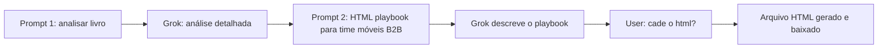

# Entendimento do projeto: Playbook Vendas Disruptivas B2B

**Overview:** Projeto nascido de uma conversa no Grok: análise do livro *Vendas Disruptivas* (Patrick Maes) → pedido de playbook HTML para time de indústria de móveis B2B (lojistas) → artefato `playbook_vendas_disruptivas_moveis_b2b.html` em Vendas30.

## Fonte da verdade

Conversa Grok compartilhada: [Análise de Vendas Disruptivas de Patrick Maes](https://grok.com/share/bGVnYWN5_32fb4259-cd48-41b2-a23a-a5bb2456f041)

Artefato local: `playbook_vendas_disruptivas_moveis_b2b.html`

Pasta `Vendas30`: só este HTML (sem repo, build ou backend).

## Fluxo da conversa no Grok (origem do projeto)

1. **Prompt 1:** *“Considere o livro Vendas Disruptivas de Patrick Maes. Faça uma análise detalhada.”*
2. **Resposta Grok:** análise do livro (premissas, estrutura, Modelo 3.0, Folha em Branco, Triple A, Value Matching, pontos fortes/limites, relevância 2026, implicações BR).
3. **Prompt 2 (pedido do artefato):** *“Construa uma página html com um playbook do livro para eu apresentar ao meu time. Faça orientado a um time de indústria de móveis que vende no mercado B2B (lojistas).”*
4. **Follow-up:** *“cade o html?”* → entrega de `playbook_vendas_disruptivas_moveis_b2b.html`.

## Intenção do usuário (extraída dos prompts)

- Apresentar ao **time interno** (não landing pública).
- Material **acionável** (playbook), não só resumo do livro.
- Domínio: **indústria de móveis → lojistas B2B** (ciclos longos, relacionamento, ajudar o lojista a vender para o consumidor final).
- Design pensado para **projeção / tela cheia**, com checklist interativo ao vivo.

## O que o HTML entrega (alinhado ao pedido)

| Pedido no Grok | No HTML |
|----------------|---------|
| Playbook do livro para o time | Seções de princípios, modelo, jornada, papéis, próximos passos |
| Orientado a móveis B2B / lojistas | Linguagem, exemplos (amostras, PDV, giro, WhatsApp, feiras) |
| Página HTML única | Single-file, Tailwind CDN, JS leve |
| Apresentação | Nav fixa, seções âncora, visual wood + navy |
| Interatividade | Checklist com barra de progresso |
| Conceitos Maes | Folha em Branco, Triple A, Value Matching, Modelo 3.0, orquestra Mkt/Vendas/CS |

### Seções do artefato

1. Hero / intro + paradoxo
2. 5 princípios
3. Modelo 3.0 (Descoberta → Pesquisa → Avaliação → Aquisição → Advocacia)
4. Jornada detalhada (lojista / time / métricas)
5. Transformação de papéis
6. Value Matching
7. Stack tecnológico BR
8. Checklist (Marketing, Vendas, CS, Time)
9. Tabela de métricas
10. Próximos passos (workshop, MQL/SQL, 2–3 métricas)

## Tese operacional que o playbook vende

**Marketing qualifica → Vendas fecha lead pronto → CS fideliza / recompra / indicação.**

Menos prospecção fria e visitas genéricas; mais qualificação, parceria/ROI para a loja e CS proativo.

## Forma técnica

- HTML estático single-file
- Tailwind CDN + cores `wood` / `navy` + Inter
- Checklist sem persistência (`localStorage` ausente)
- Print: `.no-print` na nav
- Footer: uso interno, Julho 2026; atribuição ao livro (Editora Autêntica)

## Ofertas de ajuste que o Grok já sugeriu (ainda não feitas)

- Logo / white-label da empresa
- Mudar cores ou nomes de áreas
- Mais exemplos do catálogo/portfólio real
- Versão mais curta (reunião ~30 min)
- Versão PDF

## Evoluções feitas

- Redesign visual (showroom editorial: Cormorant Garamond + Outfit, paleta ink/stone/brass)
- Seção **KPIs da Estratégia** com abas Marketing / Vendas / Ponte Mkt→Vendas
- Checklist com persistência em `localStorage`
- HTML continua single-file estático
- Excel `controle_kpis_semanal.xlsx` — registro semanal + metas + dashboard

## Próximo passo

Definir próximos ajustes (marca da empresa, PDF, versão curta, etc.).
